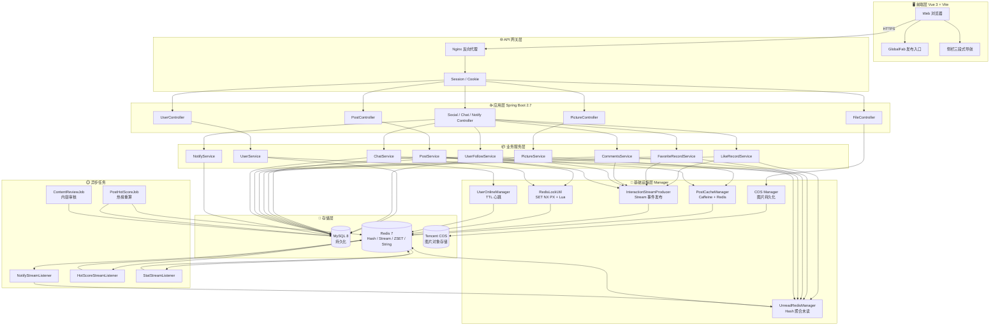
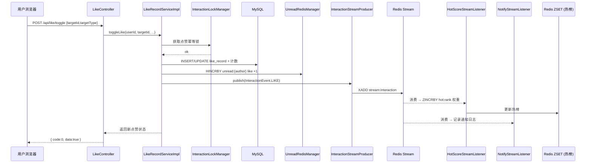
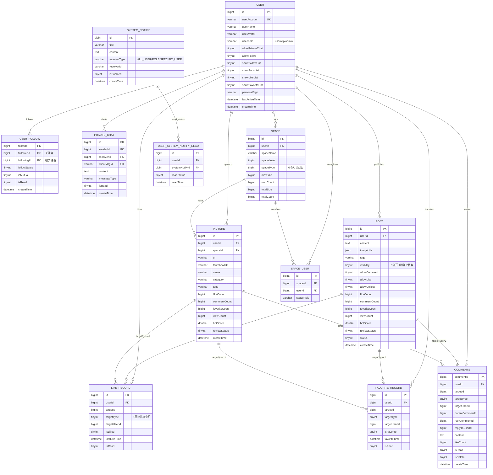

<div align="center">


# 栖图 · Nestpic

**作品的栖息之地**

> 一款集个人创作、团队协作与社交互动于一体的云端图片平台。


[项目概述](#-项目概述) · [功能清单](#-功能清单) · [技术架构](#-技术架构) · [数据库设计](#-数据库设计) · [部署运行](#-部署运行) · [接口示例](#-接口示例)

</div>

---

## 线上地址：[http://picture.xucanwei.xyz](http://picture.xucanwei.xyz) 
##📌 项目概述

**栖图 Nestpic** 是一款面向个人创作者与小型团队的云端图片平台。它既是图片的"栖息地"——负责上传、解析、检索、分享、权限管理；也是创作者的"社区"——提供关注、点赞、评论、收藏、私信、帖子（类"朋友圈"的图文动态）等完整社交能力。

系统后端基于 **Spring Boot + MyBatis-Plus + MySQL + Redis**，前端采用 **Vue 3 + Vite + Ant Design Vue**，图片存储走 **腾讯云 COS**，并大量使用 Redis 承载未读聚合、热榜、分布式锁、缓存旁路、事件流与在线状态等高并发场景。

**它解决什么问题？**

- 个人/团队的图片缺少统一栖息地：散落在微信、网盘、相册；
- 创作与分享脱节：作品没有观众，互动没有闭环；
- 自建图库又要再造一整套社交能力（点赞、评论、关注、私信、消息中心），成本高。

栖图把这两件事做成一件事：**存图 + 社区** 开箱即用。

---

## ✨ 功能清单

### 🗂 图片与空间
- 图片上传（本地 / URL 抓取 / 批量导入）、缩略图、色相提取、OSS 持久化
- 标签与分类、关键词检索、按色相检索、按相似图检索（可选拓展）
- **个人空间 / 团队空间** 双形态，容量配额可视化
- 图片审核流（机器初筛 + 管理员复审）

### 👥 账号与社交
- 账号登录、会员与管理员角色、头像裁剪
- **关注 / 粉丝**、互相关注标识、关注列表隐私开关
- **个人主页 Tab 化**（帖子 / 作品 / 喜欢 / 收藏 / 关注 / 粉丝）
- 访客视角的隐私位：`showLikeList` / `showFavoriteList` / `showFollowList` / `showFansList`

### 💬 互动
- 点赞、收藏、**两级评论**（回复他人评论触发消息通知）
- **私信**：会话列表 + 消息流 + 未读提醒，支持陌生作者首次发起
- **消息中心**：点赞 / 评论 / 收藏 / 关注 / 系统 / 私信 六类聚合未读（Redis Hash）

### 📝 动态（社区）
- "朋友圈" 式图文动态（`t_post` 独立表、1–9 张配图 / JSON 数组）
- 可见性控制（公开 / 仅粉丝 / 仅自己）、评论/点赞/收藏开关
- **拉式全局 Feed**、帖子热榜（Redis ZSET + 定时重算）

### ⚡ 性能与可靠性
- **Caffeine（L1）+ Redis（L2）** 两级 Cache-Aside（帖子详情、论坛首页）
- **Redis Stream** 事件总线（互动事件扇出：通知 / 热榜 / 统计）
- **分布式幂等锁**（发帖、私信 clientMsgId）
- **用户在线状态**（String + TTL + 心跳）
- 定时任务：热榜重算、内容审核、空间容量再校准

### 📌 当前策略取舍（2026-04）
- 图片上传大小阈值统一为 **3MB**（前端校验 + 后端强校验一致），优先保证体验与成本平衡。
- 上传链路保持 **单次上传 -> COS 处理 -> CDN 分发**；断点续传（Multipart）暂不在当前版本落地。
- 限流继续使用 **Redis ZSET 滑动窗口**（已覆盖 HTTP / WebSocket 握手 / 关键业务接口）。
- 令牌桶作为后续演进能力预留，计划在后续高并发场景或下一项目中引入。

---

## 🏗 技术架构

### 总体架构



> 架构从上到下分为：前端、网关、Controller、业务服务、Manager 基础设施、存储；右侧补充了 Redis Stream 驱动的**异步流水线**。分层清晰：Controller 只做参数与鉴权，Service 聚合业务，Manager 封装"外部依赖 / 跨服务能力"，保证可测试性与演进弹性。

---

### 数据流说明：一条点赞的完整链路



---

### 关键模块职责

| 模块 | 类名（示例） | 职责 |
| --- | --- | --- |
| **图片域** | `PictureService` / `PictureCacheManager` | 上传、解析、色相/缩略图、检索、审核、两级缓存 |
| **帖子域** | `PostService` / `PostCacheManager` | 动态 CRUD、拉式 Feed、Cache-Aside、幂等发布 |
| **互动域** | `LikeRecordService` / `FavoriteRecordService` / `CommentsService` | 三类互动统一 `targetType` 抽象（1 图片 / 2 帖子 / 3 空间） |
| **社交域** | `UserFollowService` / `ChatService` | 关注/粉丝、私信会话、幂等 clientMsgId |
| **消息中心** | `NotifyService` / `UnreadRedisManager` | 聚合未读 Hash、按类型标记已读、DB 回源 |
| **事件总线** | `InteractionStreamProducer` / 3 个 Listener | Stream 扇出：通知 / 热榜 / 统计 |
| **基础设施** | `RedisLockUtil` / `UserOnlineManager` / `PostHotScoreJob` | 分布式锁、在线心跳、热榜定时重算 |

---

### 核心代码片段

#### 1. 两级 Cache-Aside：帖子详情

```java
public PostVO getDetail(Long postId) {
    String localKey = "post:detail:" + postId;
    String local = localCache.getIfPresent(localKey);
    if (local != null) return parseNullable(local);

    String raw = stringRedisTemplate.opsForValue().get(localKey);
    if (raw != null) {
        localCache.put(localKey, raw);
        return parseNullable(raw);
    }
    return null;
}

public void putDetail(Long postId, PostVO vo) {
    String json = vo == null ? NULL_PLACEHOLDER : JSONUtil.toJsonStr(vo);
    long ttl = vo == null ? 60 : 300 + RANDOM.nextInt(120);
    stringRedisTemplate.opsForValue().set("post:detail:" + postId, json, ttl, TimeUnit.SECONDS);
    localCache.put("post:detail:" + postId, json);
}

public void invalidateDetail(Long postId) {
    String key = "post:detail:" + postId;
    stringRedisTemplate.delete(key);
    localCache.invalidate(key);
    scheduler.schedule(() -> {   // 延迟双删，兜底主从延迟 / 并发写
        stringRedisTemplate.delete(key);
        localCache.invalidate(key);
    }, 2, TimeUnit.SECONDS);
}
```

#### 2. Redis Hash 聚合未读 + 事件扇出

```java
@Transactional(rollbackFor = Exception.class)
public boolean toggleLike(Long userId, Long targetId, Integer targetType, User loginUser) {
    // ... 互斥锁 + DB 计数 ...
    if (newLiked == 1 && targetUserId != null && !targetUserId.equals(userId)) {
        unreadRedisManager.incLike(targetUserId);          // HINCRBY unread:{uid} like 1
    }
    interactionStreamProducer.publish(InteractionEvent.of( // XADD stream:interaction
            newLiked == 1 ? InteractionEvent.TYPE_LIKE : InteractionEvent.TYPE_UNLIKE,
            userId, targetUserId, targetType, targetId));
    return newLiked == 1;
}
```

---

## 🗄 数据库设计

### ER 图（核心表）



### 表结构说明（节选）

| 表名 | 职责 | 关键索引 |
| --- | --- | --- |
| `user` | 账号、角色、隐私开关、个性签名 | `UNIQUE (userAccount)` |
| `picture` | 图片记录、热度、审核、互动计数 | `idx_picture_hot_score`, `idx_picture_like_count` |
| `t_post` | 动态/帖子 | `idx_post_user_time`, `idx_post_hot`, `idx_post_time` |
| `like_record` | 通用点赞表（1 行 = 1 人对 1 目标） | `UNIQUE (userId, targetId, targetType)` |
| `favorite_record` | 通用收藏表，结构同 `like_record` | 同上 |
| `comments` | 两级评论（`rootCommentId` + `parentCommentId` + `replyToUserId`） | `idx_target`, `idx_root` |
| `user_follow` | 关注关系，`isMutual` 冗余互关标记 | `UNIQUE (followerId, followingId)` |
| `private_chat` | 私信消息，`clientMsgId` 前端去重 | `UNIQUE (senderId, clientMsgId)` |
| `space` / `space_user` | 空间与成员 | — |
| `system_notify` / `user_system_notify_read` | 系统公告 + 用户已读态 | — |

---

## 🚀 部署运行

### 环境要求

| 组件 | 版本 |
| --- | --- |
| JDK | 8+ |
| Node.js | 16+ |
| Maven | 3.6+ |
| MySQL | 8.0+ |
| Redis | 7.x |
| 腾讯云 COS | 有效 SecretKey |

### 步骤 1：克隆并初始化数据库

```bash
git clone https://github.com/EddieCww/picture.git
cd picture

# 按顺序执行结构脚本（DDL-only，不导入数据）
# 注意：create_table.sql 需先执行；全量初始化完成后不要单独重复执行它
mysql -u root -p picture < picture-backend/sql/create_table.sql
mysql -u root -p picture < picture-backend/sql/picture.sql
mysql -u root -p picture < picture-backend/sql/space.sql
mysql -u root -p picture < picture-backend/sql/feature_social.sql
mysql -u root -p picture < picture-backend/sql/feature_post.sql
mysql -u root -p picture < picture-backend/sql/feature_post_privacy.sql
```

### 步骤 2：配置后端

编辑 `picture-backend/src/main/resources/application.yml` 或 `application-local.yml`：

```yaml
spring:
  datasource:
    url: jdbc:mysql://localhost:3306/picture?useSSL=false&characterEncoding=utf8
    username: root
    password: ${MYSQL_PASSWORD}
  redis:
    host: localhost
    port: 6379

cos:
  client:
    host: https://your-bucket.cos.ap-guangzhou.myqcloud.com
    secretId: ${COS_SECRET_ID}
    secretKey: ${COS_SECRET_KEY}
    region: ap-guangzhou
    bucket: your-bucket
```

### 步骤 3：启动后端

```bash
cd picture-backend
mvn clean package -DskipTests
java -jar target/picture-backend-0.0.1-SNAPSHOT.jar
# 默认端口 8123，接口前缀 /api
```

### 步骤 4：启动前端

```bash
cd picture-frontend
npm install
npm run dev       # 开发：http://localhost:5173
npm run build     # 生产构建 → dist/
```

### 可选：Docker Compose（参考）

```yaml
version: "3"
services:
  mysql: { image: mysql:8, environment: [MYSQL_ROOT_PASSWORD=root] }
  redis: { image: redis:7-alpine }
  backend:
    build: ./picture-backend
    depends_on: [mysql, redis]
    ports: ["8123:8123"]
  frontend:
    build: ./picture-frontend
    ports: ["80:80"]
```

---

## 🔌 接口示例

### 1. 发布帖子

```http
POST /api/post/add
Content-Type: application/json
Cookie: JSESSIONID=...

{
  "content": "今天摸鱼了吗？",
  "imageUrls": ["https://cdn.../1.webp", "https://cdn.../2.webp"],
  "visibility": 0,
  "allowComment": 1,
  "allowLike": 1,
  "allowCollect": 1,
  "tags": "[\"日常\"]",
  "location": "广东深圳"
}
```

**响应**：

```json
{
  "code": 0,
  "data": "1945506895712337922",
  "message": "ok"
}
```

> `data` 为帖子 ID，19 位 BIGINT，**前端必须作为字符串处理**以防精度丢失。

### 2. 拉取消息中心未读聚合

```http
GET /api/notify/unread
```

**响应**：

```json
{
  "code": 0,
  "data": {
    "likeCount": 3,
    "commentCount": 2,
    "favoriteCount": 0,
    "followCount": 1,
    "systemCount": 0,
    "totalCount": 6
  }
}
```

> 后端优先走 Redis Hash（`unread:{uid}`），未命中再回源 DB 并回填，TTL 30 分钟。

---

## 🛣 未来规划

- **RAG 搜索**：接入多模态向量库（CLIP + Redis Vector / Milvus），支持"以图搜图 + 自然语言搜图"；
- **WebSocket 推送**：把现有 Redis Stream + 轮询升级为 STOMP / SockJS 实时双向，降低私信与未读的感知延迟；
- **创作工作台**：AI 辅助调色 / 扩图 / 去水印，与 COS CI 图像处理链打通；
- **多租户团队版**：引入组织（Org）→ 空间（Space）→ 项目（Project）三级模型，配额按组织结算；
- **可观测性**：Prometheus + Grafana 监控 Redis 命中率、Stream backlog、慢 SQL。

---

## 📄 License

MIT © EddieCww
